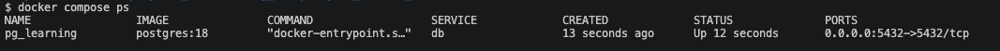
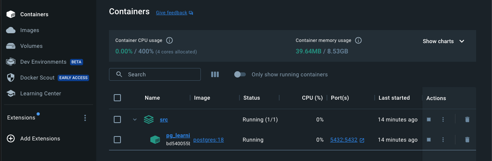
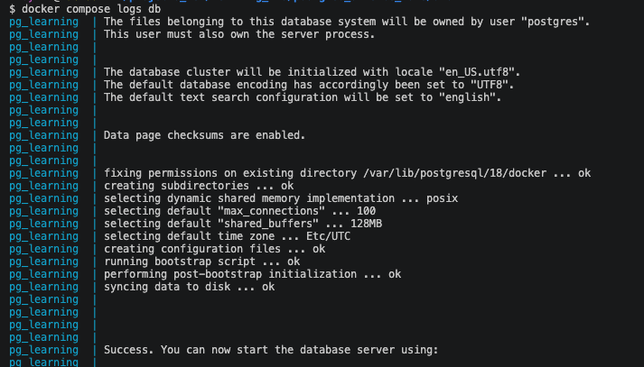
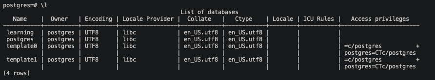

# Installing PostgreSQL 18 with Docker on macOS

> **Date:** 2026-04-06 | **Session #:** 2 | **Duration:** ~2h
> **Roadmap:** Phase 1 → Installation

Instead of installing PostgreSQL natively or via Homebrew, we use Docker — isolated environment, easy to reset, easy to switch versions. One config file, one command, done.

## Prerequisites

- macOS with [Docker Desktop](https://www.docker.com/products/docker-desktop/) installed
- Terminal (zsh)

## Key Concepts

- **Docker image** — a read-only template with everything needed to run an app (OS, PostgreSQL binaries, config)
- **Docker container** — a running instance of an image; isolated process with its own filesystem
- **docker-compose** — a tool to define and run multi-container apps via a YAML config file
- **Volume** — persistent storage that survives container restarts and removals
- **Port mapping** — exposing container's internal port to the host machine (`host:container`)
- **Environment variables** — configuration passed to the container at startup (user, password, db name)

---

## 1. Verify Docker installation

Make sure Docker is installed and running:

```bash
docker --version
```

Expected output: `Docker version 28.x.x` (or similar).
I've got:
```bash
Docker version 24.0.2, build cb74dfc
```

> 💡 Docker Desktop on macOS runs a lightweight Linux VM under the hood.
> PostgreSQL inside the container runs on Linux, even though your host is macOS.

## 2. Create project structure

! Important: From now on, all commands should be run from the project root (where `src/` is located).

```bash
mkdir -p src
cd src
mkdir -p init
touch docker-compose.yml
```

We need three files inside `src/`:

```
src/
├── docker-compose.yml    # container configuration
├── .env                  # credentials (not committed to git)
├── .env.example          # template for .env (committed to git) it's like an interface for new contributors shows what variables are needed without exposing real values. Always keep it up to date with .env
└── init/                 # SQL scripts that run on first launch
```

## 3. Create docker-compose.yml

Create `docker-compose.yml`:

```yaml
services:
  db:
    image: postgres:18
    container_name: pg_learning
    restart: unless-stopped
    ports:
      - "${POSTGRES_PORT:-5432}:5432"
    volumes:
      - pgdata:/var/lib/postgresql
      - ./init:/docker-entrypoint-initdb.d
    env_file:
      - .env

volumes:
  pgdata:
```

To get more information about official postgres image and its configuration options, check the [Docker Hub page](https://hub.docker.com/_/postgres) and the [official documentation](https://www.postgresql.org/docs/18/app-postgres.html#APP-POSTGRES-ENVIRONMENT).

Let's break it down:

| Field | What it does |
|-------|-------------|
| `image: postgres:18` | Official PostgreSQL 18 image from Docker Hub |
| `container_name: pg_learning` | Human-readable name instead of random hash |
| `restart: unless-stopped` | Auto-restart on crash or reboot (unless you explicitly stopped it) |
| `ports: "5432:5432"` | Map host port → container port, so tools on macOS can connect |
| `volumes: pgdata:...` | Named volume — data persists even after `docker compose down` |
| `volumes: ./init:...` | Mount local `init/` folder — scripts here run on **first** container start |
| `env_file: .env` | Load environment variables from `.env` file |

> 📝 `env_file` замість `environment:` — розділяємо секрети від конфігурації.
> У compose-файлі — структура, в `.env` — значення. Чисто.

> 💡 `/docker-entrypoint-initdb.d` — спеціальна директорія в офіційному postgres-образі.
> Всі `.sql` та `.sh` файли в ній виконуються автоматично при **першому** створенні бази.
> Якщо volume вже має дані — скрипти ігноруються.

> ⚠️ `pgdata` — це **named volume**, не bind mount. Docker зберігає його в своєму
> внутрішньому сховищі. Щоб видалити дані повністю: `docker compose down -v`.

> ⚠️ **PostgreSQL 18+ breaking change:** volume монтується на `/var/lib/postgresql` (НЕ `/var/lib/postgresql/data`).
> З версії 18 PostgreSQL створює піддиректорію `18/data` автоматично — це потрібно для `pg_upgrade`.
> Якщо монтувати на старий шлях — отримаєш помилку про несумісний формат.
> Детальніше: [docker-library/postgres#1259](https://github.com/docker-library/postgres/pull/1259)

## 4. Create .env.example

Create `.env.example` — template that **is** committed to git:

```bash
touch .gitignore
```

```bash
printf "POSTGRES_USER=your_user_here\nPOSTGRES_PASSWORD=your_password_here\nPOSTGRES_DB=your_db_here\nPOSTGRES_PORT=your_port_here\n" > .env.example

```

## 5. Create .env file

Create `.env`:
For it you need to copy the `.env.example` file and fill in the values. You can do it manually or with a command:

```bash
cp .env.example .env
```

```env
POSTGRES_USER=postgres
POSTGRES_PASSWORD=postgres
POSTGRES_DB=learning
POSTGRES_PORT=5432
```

Add `.env` to `.gitignore` so real credentials are never committed:

```bash
echo ".env" >> .gitignore
```

> 📝 `POSTGRES_USER`, `POSTGRES_PASSWORD`, `POSTGRES_DB` — це змінні які
> офіційний postgres-образ [читає при першому старті](https://hub.docker.com/_/postgres)
> для створення суперюзера і дефолтної бази.

> ⚠️ Це навчальне середовище, тому прості паролі ок. В продакшені — ніколи.


## 6. Launch the container

```bash
cd src
docker compose up -d
```
Output example:
```bash
[+] Running 14/1
 ✔ db 13 layers [⣿⣿⣿⣿⣿⣿⣿⣿⣿⣿⣿⣿⣿]      0B/0B      Pulled                                                                                                                                                               23.4s 
[+] Running 3/3
 ✔ Network src_default    Created  0.2s 
 ✔ Volume "src_pgdata"    Created  0.0s 
 ✔ Container pg_learning  Started  1.8s
```

> 📝 `up` — створює і запускає контейнери. `-d` (detached) — у фоновому режимі.
> Без `-d` термінал буде зайнятий логами контейнера.

Check status:

```bash
docker compose ps
```

Expected: container `pg_learning` with status `Up` or `running`.

like on the screenshot:


in GUI (Docker Desktop) you should see `pg_learning` container running.


If something went wrong, check logs:

```bash
docker compose logs db
```



## 7. Verify connection

Connect from inside the container:

```bash
docker compose exec db psql -U postgres
```

```sh
psql (18.3 (Debian 18.3-1.pgdg13+1))
Type "help" for help.

postgres=# 
```

> 💡 `exec` виконує команду в **вже запущеному** контейнері.
> `run` натомість створює **новий** тимчасовий контейнер — це інше.

Once inside psql, check the version:

```sql
SELECT version();
```

Expected:
```sh
                              version            
------------------------------------------------------------------
 PostgreSQL 18.3 (Debian 18.3-1.pgdg13+1) on aarch64-unknown-linux-gnu, compiled by gcc (Debian 14.2.0-19) 14.2.0, 64-bit
(1 row)
```

List databases:

```sql
\l
```

You should see `learning` database (created from `POSTGRES_DB`).



Exit psql:

```
\q
```

## 8. Useful docker compose commands

| Command | What it does |
|---------|-------------|
| `docker compose up -d` | Start containers in background |
| `docker compose down` | Stop and remove containers (data preserved in volume) |
| `docker compose down -v` | Stop, remove containers **and volumes** (⚠️ data lost!) |
| `docker compose ps` | Show running containers |
| `docker compose logs db` | View container logs |
| `docker compose exec db psql -U postgres` | Open psql inside container |
| `docker compose restart db` | Restart the database container |

> 💡 `docker compose` (з пробілом) — нова версія, плагін до Docker CLI.
> `docker-compose` (з дефісом) — стара standalone версія. Обидва працюють,
> але нова рекомендована.

---

## Summary

- Docker = ізольоване середовище, один файл конфігурації, один `up -d` — і PostgreSQL готовий
- `docker-compose.yml` описує **що** запускати, `.env` — **з якими параметрами**
- Named volume (`pgdata`) зберігає дані між рестартами
- `init/` — скрипти для початкового налаштування (виконуються тільки при першому старті)
- `exec` vs `run` — використовуй `exec` для вже запущених контейнерів

## What's Next

- [ ] GUI client — DBeaver installation & connection setup
- [ ] Architectural fundamentals — client/server model
- [ ] Creating a database — via docker exec, via psql, via DBeaver
