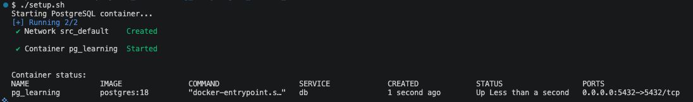
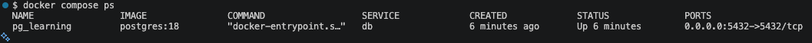

# Automated Management Scripts for PostgreSQL Environment

> **Date:** 2026-04-10 | **Session #:** 3 | **Duration:** ~1h  
> **Roadmap:** Phase 1 → Setup scripts

## Prerequisites

- Docker Desktop (macOS)
- Terminal (zsh)
- Project structure from session 2 (`src/` with `docker-compose.yml`, `.env`, `.env.example`)

---

## Goal

Create three shell scripts that automate the PostgreSQL Docker environment lifecycle:

| Script | Action |
|--------|--------|
| `setup.sh` | Start environment (creates `.env` if missing) |
| `stop.sh` | Stop container (data preserved) |
| `reset.sh` | Full reset — destroy all data and re-initialize |

---

## Key Concepts

- **Shell script** — executable text file with shell commands, runs top to bottom
- **`set -e`** — abort script immediately if any command fails (prevents silent errors)
- **`cd "$(dirname "$0")"`** — change directory to where the script itself lives, so paths are always relative to the script, not wherever you called it from
- **`chmod +x`** — grant execute permission to a file; without it, the OS won't run it as a script
- **Idempotent script** — safe to run multiple times; same result regardless of current state

---

## 1. Create the scripts

All three scripts go into `src/`:

```
src/
├── docker-compose.yml
├── .env
├── .env.example
├── init/
├── setup.sh       ← new
├── stop.sh        ← new
└── reset.sh       ← new
```

Open the `src/` directory in your terminal and create the files:

```bash
cd src
touch setup.sh stop.sh reset.sh
```

And add the following content to each:

### setup.sh

```bash
#!/bin/bash
# setup.sh — Start PostgreSQL Docker environment
# Usage: ./setup.sh

set -e
cd "$(dirname "$0")"

# Ensure .env exists — copy from template if not
if [ ! -f .env ]; then
  if [ -f .env.example ]; then
    cp .env.example .env
    echo ".env created from .env.example. Please edit credentials if needed."
  else
    echo "Error: .env.example not found. Cannot create .env."
    exit 1
  fi
fi

echo "Starting PostgreSQL container..."
docker compose up -d

echo ""
echo "Container status:"
docker compose ps
```

What it does step by step:
- `set -e` — stops on any error, no silent failures
- `cd "$(dirname "$0")"` — ensures paths like `.env` and `docker-compose.yml` resolve correctly regardless of where you call the script from
- `.env` check — auto-creates from `.env.example` if missing, so a new contributor can run `./setup.sh` right away
- `docker compose up -d` — starts container in background
- `docker compose ps` — immediate confirmation that it's running

### stop.sh

```bash
#!/bin/bash
# stop.sh — Stop PostgreSQL Docker environment
# Usage: ./stop.sh

set -e
cd "$(dirname "$0")"

echo "Stopping PostgreSQL container..."
docker compose down
```

`docker compose down` stops and removes the container but **keeps the named volume** (`pgdata`) — your data is safe.

### reset.sh

```bash
#!/bin/bash
# reset.sh — Full reset of PostgreSQL Docker environment
# ⚠️  WARNING: destroys all data including the volume
# Usage: ./reset.sh

set -e
cd "$(dirname "$0")"

echo "⚠️  This will destroy ALL data including the database volume."
echo "Stopping containers and removing volumes..."
docker compose down -v

echo ""
echo "Re-initializing environment..."
./setup.sh
```

`docker compose down -v` removes both the container and the named volume — all database data is gone. After that it calls `./setup.sh` to bring everything back up fresh.

> 💡 Use `reset.sh` when you want to start from a completely clean state — e.g. after schema experiments that went wrong, or to re-run `init/` scripts.

---

## 2. Make scripts executable

By default, new files have no execute permission:

```bash
ls -la *.sh
```
```
-rw-r--r--  setup.sh
-rw-r--r--  stop.sh
-rw-r--r--  reset.sh
```

Grant execute permission:

```bash
chmod +x setup.sh stop.sh reset.sh
```

Verify:

```bash
ls -la *.sh
```
```
-rwxr-xr-x  setup.sh
-rwxr-xr-x  stop.sh
-rwxr-xr-x  reset.sh
```

Permission breakdown: `rwxr-xr-x`

| Part | Who | Permissions |
|------|-----|-------------|
| `rwx` | owner | read, write, execute |
| `r-x` | group | read, execute |
| `r-x` | others | read, execute |

Without `+x`, running `./setup.sh` gives: `permission denied`.

---

## 3. Usage

```bash
cd src

./setup.sh   # first time or after stop — starts the environment
./stop.sh    # pause work — container gone, data safe
./reset.sh   # clean slate — ⚠️ all data destroyed
```

The example output after `./setup.sh`:



Verify the container is running after `setup.sh`:

```bash
docker compose ps
```

Expected: `pg_learning` with status `running`.



---

## Summary

- Three scripts cover the full lifecycle: start → stop → reset
- `set -e` + `cd "$(dirname "$0")"` make scripts safe and portable
- `setup.sh` is idempotent — safe to run even if already running
- `reset.sh` chains into `setup.sh` — one command for full wipe + restart
- Any contributor can clone the repo and run `./setup.sh` immediately

## What's Next

- [ ] GUI client — DBeaver installation & connection setup
- [ ] Architectural fundamentals — client/server model
- [ ] Creating and accessing databases via different tools
