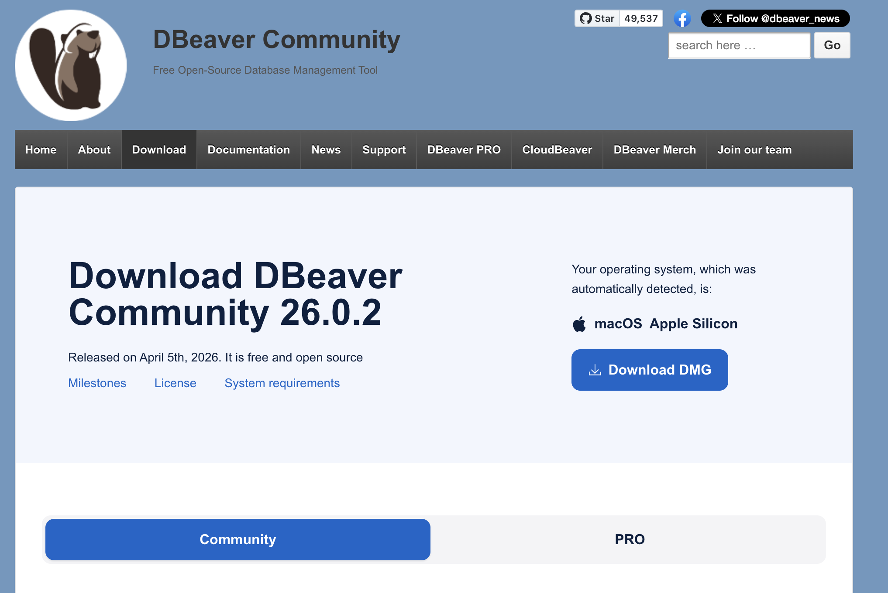
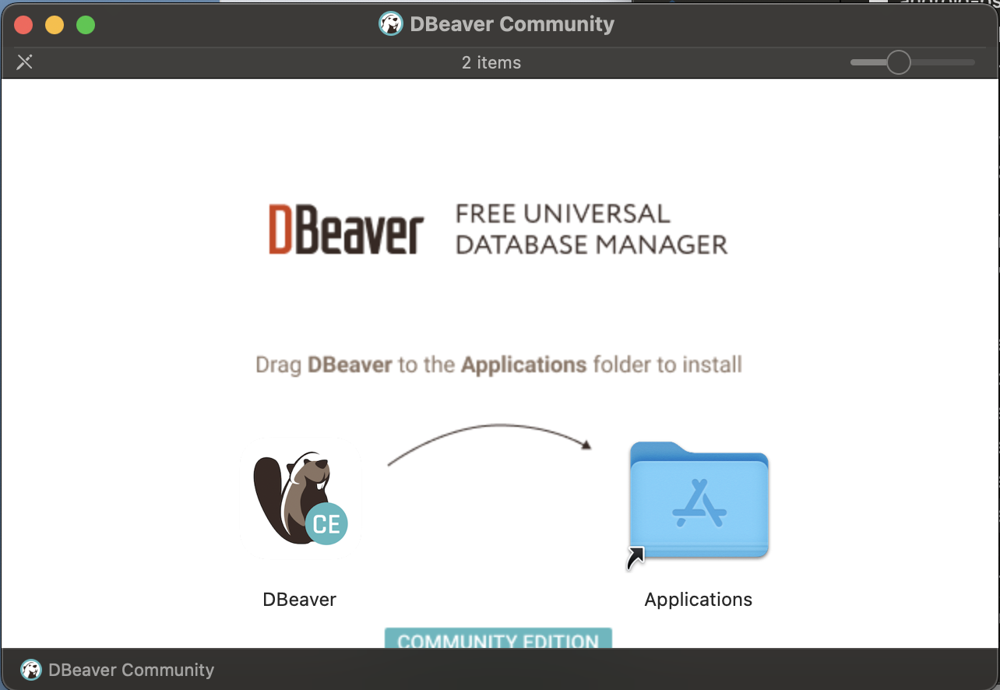
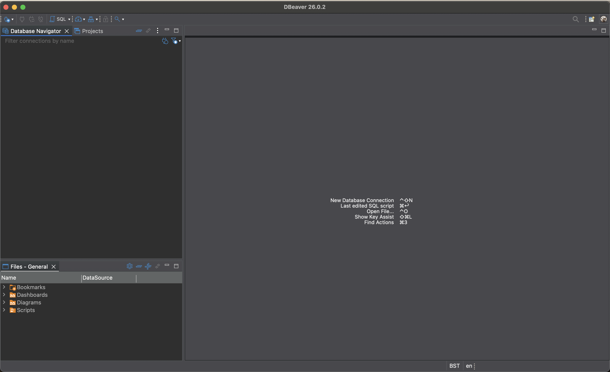
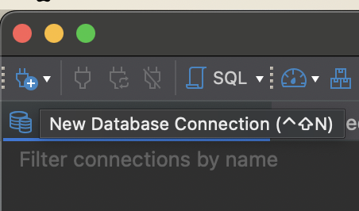
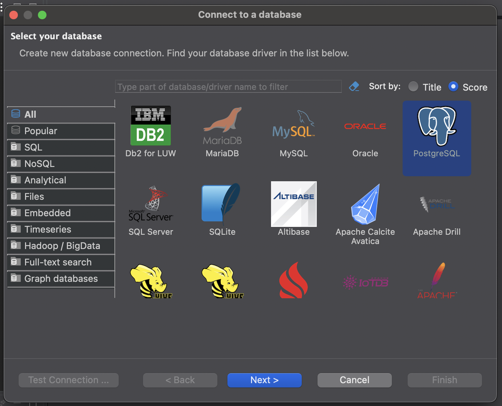
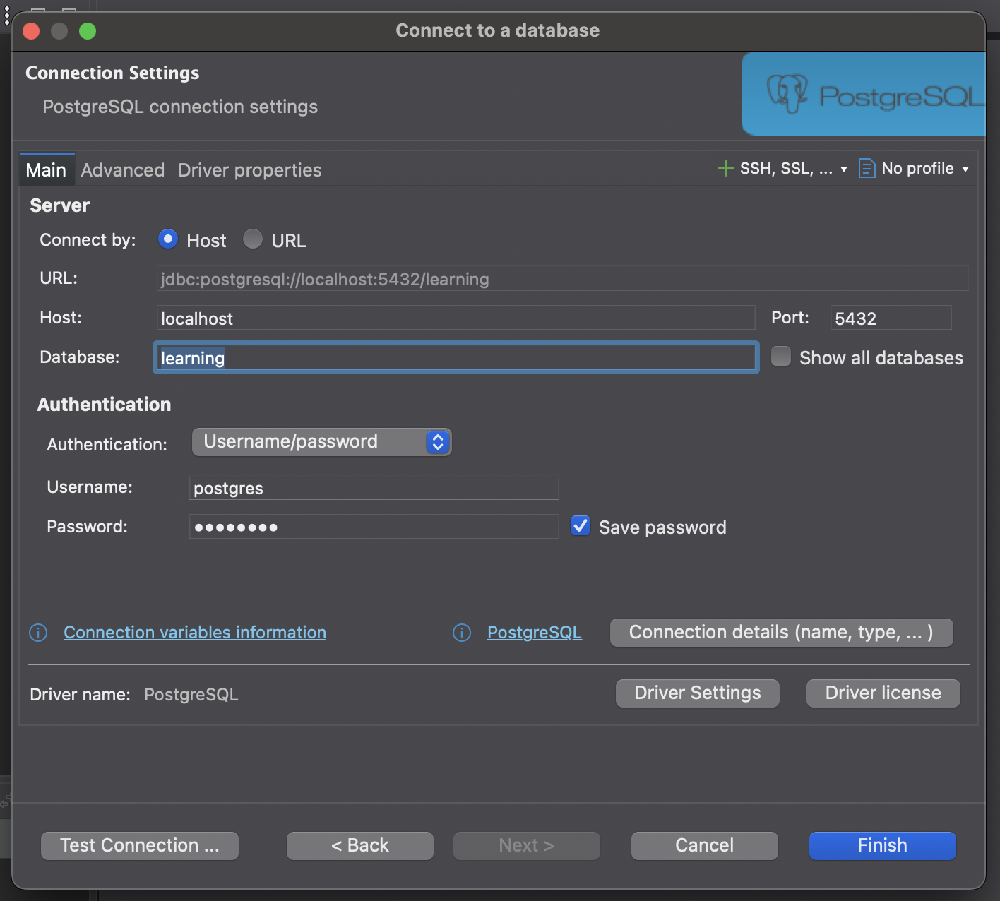
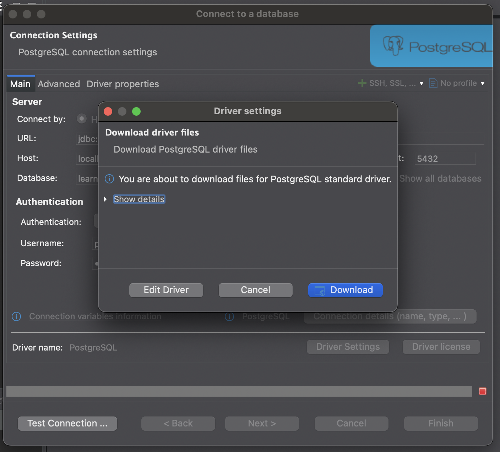
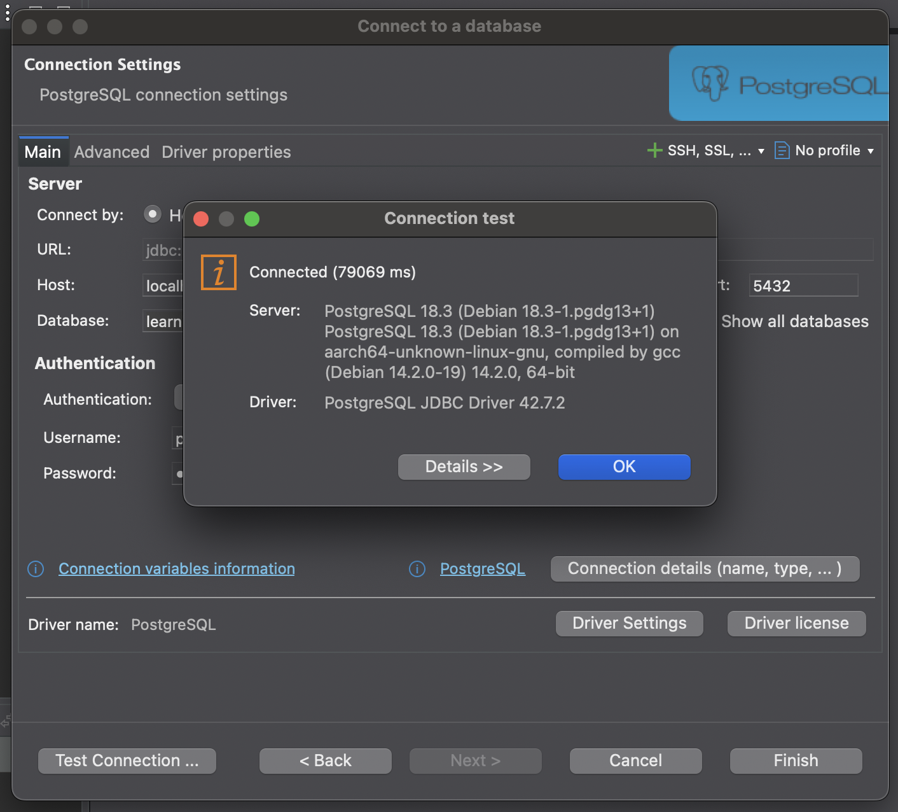
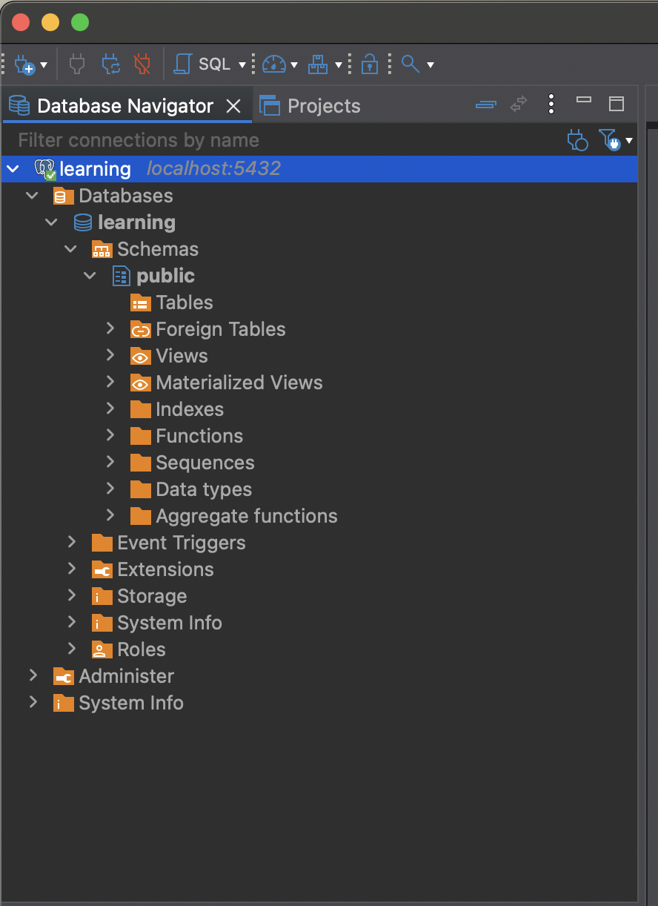

# DBeaver Community: Installation and Connection to PostgreSQL

> **Date:** 2026-04-11 | **Session #:** 4 | **Duration:** ~30m
> **Roadmap:** Phase 1 → GUI client

DBeaver is a free, universal database management tool with a GUI — instead of typing commands in psql, you can browse tables, run queries, and explore the database visually. We install it and connect to our existing PostgreSQL Docker container.

## Prerequisites

- macOS (Apple Silicon)
- Docker container `pg_learning` running (`./setup.sh`)
- Credentials from `src/.env`

---

## Key Concepts

- **DBeaver Community** — free, open-source GUI client for databases; supports PostgreSQL, MySQL, SQLite and many others
- **JDBC Driver** — Java-based connector that DBeaver uses to communicate with PostgreSQL; downloaded automatically on first connection
- **Database Navigator** — left panel in DBeaver showing the tree of connections, databases, schemas, tables
- **Connection profile** — saved set of credentials and settings for a specific database

---

## 1. Download DBeaver

Go to [dbeaver.io/download](https://dbeaver.io/download/).

The site auto-detects your OS. For Apple Silicon Mac — click **Download DMG**.



> 💡 Always download from the official site. Version in the screenshot: **26.0.2**.

---

## 2. Install DBeaver

Open the downloaded `.dmg` file. Drag **DBeaver** to the **Applications** folder.



Eject the `.dmg` after installation — it's no longer needed.

---

## 3. Open DBeaver

Launch DBeaver from Applications. On first launch you'll see an empty **Database Navigator** panel on the left and a welcome area in the center.



---

## 4. Create a new connection

Click the plug icon with `+` in the top-left toolbar — **New Database Connection** (`⌃⇧N`).



---

## 5. Select PostgreSQL

In the **Connect to a database** dialog, PostgreSQL appears highlighted (sorted by Score by default). Select it and click **Next**.



---

## 6. Fill in connection settings

Fill in the **Connection Settings** form using values from your `src/.env`:

| Field | Value |
|-------|-------|
| Host | `localhost` |
| Port | `5432` |
| Database | `learning` |
| Username | `postgres` |
| Password | `postgres` |

Check **Save password** so you don't re-enter it every time.



> 💡 The URL field auto-updates as you type: `jdbc:postgresql://localhost:5432/learning` — this is the JDBC connection string DBeaver uses internally.

---

## 7. Download the PostgreSQL driver

Click **Test Connection...**. On first run, DBeaver will prompt to download the PostgreSQL JDBC driver — click **Download**.



> 📝 DBeaver doesn't bundle database drivers — it downloads them on demand. The driver (`PostgreSQL JDBC Driver 42.7.2`) is downloaded once and cached locally.

---

## 8. Verify connection

After the driver downloads, the connection test completes:



**Connected (79069 ms)** — connection successful.

> ⚠️ `79069 ms` — це довго для локального з'єднання. Причина: час на завантаження драйвера включено в цей результат. Наступні підключення будуть миттєвими.

Click **OK**, then **Finish**.

---

## 9. Explore in Database Navigator

The connection `learning — localhost:5432` appears in **Database Navigator**. Expand it to see the full tree:

```
learning  localhost:5432
└── Databases
    └── learning
        └── Schemas
            └── public
                ├── Tables        ← empty for now
                ├── Views
                ├── Functions
                ├── Sequences
                └── ...
```



> 📝 **Tables** is empty — we haven't created any yet. That's the next step.

---

## Summary

- DBeaver Community — безкоштовний GUI клієнт, встановлюється перетягуванням у Applications
- При першому підключенні до PostgreSQL DBeaver автоматично завантажує JDBC драйвер
- Параметри підключення беремо з `src/.env` — `localhost:5432`, database `learning`, user `postgres`
- Database Navigator показує повну структуру БД: схеми, таблиці, функції, індекси

## What's Next

- [ ] Architectural fundamentals — client/server model, how PostgreSQL works
- [ ] Creating a database — via psql, via DBeaver
- [ ] Accessing a database — psql basics, DBeaver query console
