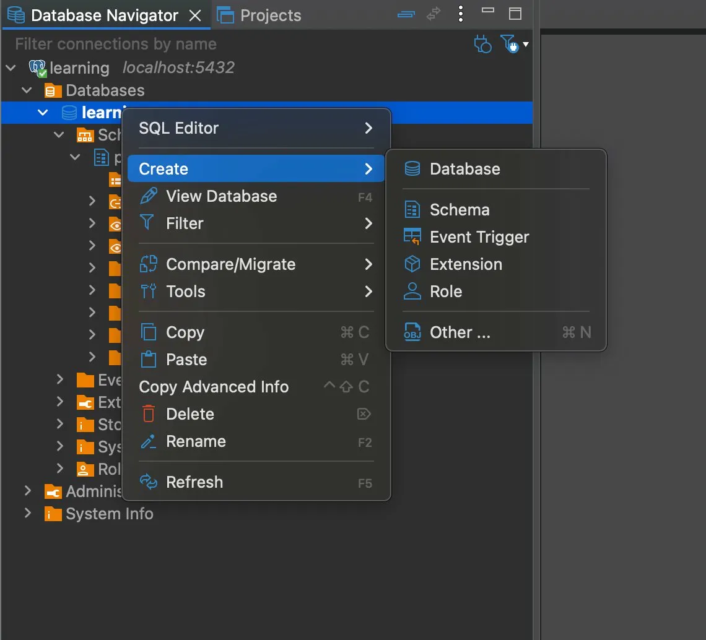
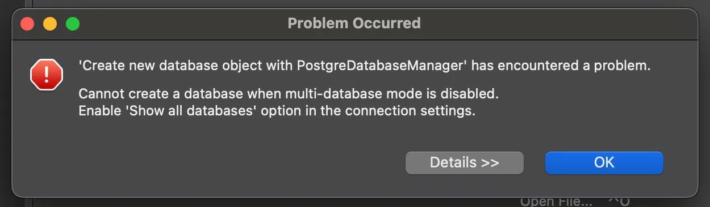
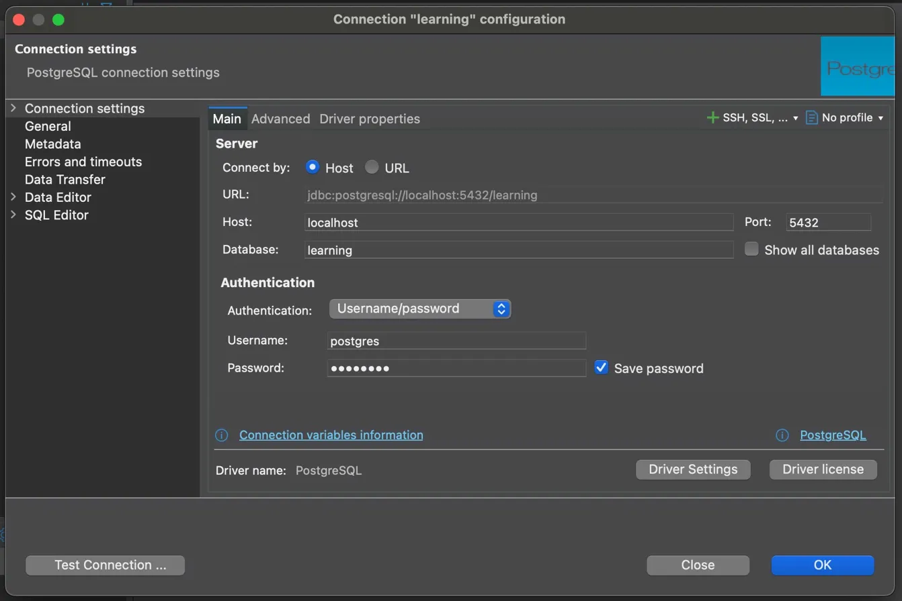
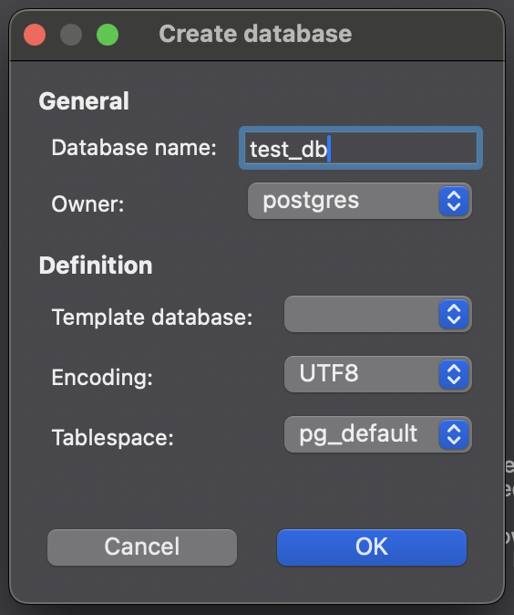

# Creating a Database

> **Date:** 2026-04-12 | **Session #:** 5 | **Duration:** ~30m
> **Roadmap:** Phase 1 → Creating a database
> **Docs:** [PostgreSQL 18 — 1.3. Creating a Database](https://www.postgresql.org/docs/18/tutorial-createdb.html)

PostgreSQL lets you create databases in multiple ways. We cover three: via `CREATE DATABASE` in psql, via `createdb` CLI utility, and via DBeaver GUI.

---

## Prerequisites

- Docker container `pg_learning` running (`./setup.sh`)
- DBeaver connected to `localhost:5432`

---

## Key Concepts

- **Database** — isolated namespace for tables, schemas, functions and other objects; one PostgreSQL server can run many databases simultaneously
- **`CREATE DATABASE`** — SQL command to create a database from inside psql
- **`createdb`** — PostgreSQL CLI utility; a wrapper around `CREATE DATABASE`, runs without entering psql
- **`DROP DATABASE`** — SQL command to permanently delete a database and all its contents
- **template1** — default template used when creating a new database; every new database is a clone of it
- **Show all databases** — DBeaver setting that enables multi-database mode; required to create databases via GUI

---

## What databases exist by default

Before creating anything, connect to psql and check what's already there:

```bash
docker compose exec db psql -U postgres
```

```
psql (18.3 (Debian 18.3-1.pgdg13+1))
Type "help" for help.

postgres=# 
```

```sql
\l
```

```
   Name    |  Owner   | Encoding | Locale Provider |  Collate   |   Ctype
-----------+----------+----------+-----------------+------------+------------
 learning  | postgres | UTF8     | libc            | en_US.utf8 | en_US.utf8
 postgres  | postgres | UTF8     | libc            | en_US.utf8 | en_US.utf8
 template0 | postgres | UTF8     | libc            | en_US.utf8 | en_US.utf8
 template1 | postgres | UTF8     | libc            | en_US.utf8 | en_US.utf8
```

| Database | Purpose |
|----------|---------|
| `learning` | our working database, created from `POSTGRES_DB` in `.env` |
| `postgres` | system database for administrative connections |
| `template1` | default template — every new database is a clone of it |
| `template0` | clean read-only template; used for restore and encoding-specific database creation |

> 💡 `template0` і `template1` — не видаляй. `template0` — еталон, до якого можна повернутись якщо `template1` буде змінений.

---

## 1. Create a database via psql

From inside psql:

```sql
CREATE DATABASE mydb;
```

```
CREATE DATABASE
```

Verify:

```sql
\l
```

```
   Name    |  Owner   | Encoding | Locale Provider |  Collate   |   Ctype
-----------+----------+----------+-----------------+------------+------------
 learning  | postgres | UTF8     | libc            | en_US.utf8 | en_US.utf8
 mydb      | postgres | UTF8     | libc            | en_US.utf8 | en_US.utf8
 postgres  | postgres | UTF8     | libc            | en_US.utf8 | en_US.utf8
 template0 | postgres | UTF8     | libc            | en_US.utf8 | en_US.utf8
 template1 | postgres | UTF8     | libc            | en_US.utf8 | en_US.utf8
```

`mydb` appears in the list with owner `postgres`.

Drop it when done:

```sql
DROP DATABASE mydb;
```

> ⚠️ `DROP DATABASE` видаляє базу і **всі її дані** миттєво, без підтвердження. Немає undo.

Exit psql:

```sql
\q
```

---

## 2. Create a database via createdb

`createdb` is a CLI utility that creates a database without entering psql:

```bash
docker compose exec db createdb -U postgres mydb
```

No output — that's expected, it means success. Verify:

```bash
docker compose exec db psql -U postgres -c "\l"
```

```
   Name    |  Owner   | Encoding | Locale Provider |  Collate   |   Ctype
-----------+----------+----------+-----------------+------------+------------
 learning  | postgres | UTF8     | libc            | en_US.utf8 | en_US.utf8
 mydb      | postgres | UTF8     | libc            | en_US.utf8 | en_US.utf8
 postgres  | postgres | UTF8     | libc            | en_US.utf8 | en_US.utf8
 template0 | postgres | UTF8     | libc            | en_US.utf8 | en_US.utf8
 template1 | postgres | UTF8     | libc            | en_US.utf8 | en_US.utf8
```

`mydb` is present. Drop it:

```bash
docker compose exec db psql -U postgres -c "DROP DATABASE mydb;"
```

> 💡 `createdb` — обгортка над `CREATE DATABASE`. Зручна для скриптів і автоматизації — не потребує інтерактивного psql.

---

## 3. Create a database via DBeaver

### 3.1 Enable "Show all databases"

Right-click on `learning` → **Create → Database**:



By default DBeaver connects to a single database and blocks database creation. Attempting **Create → Database** shows an error:



```
Cannot create a database when multi-database mode is disabled.
Enable 'Show all databases' option in the connection settings.
```

Fix: right-click on `learning localhost:5432` → **Edit Connection** → **Main** tab → check **Show all databases** → **OK**.



> 📝 Після цього DBeaver перепідключається і показує всі бази на сервері.

### 3.2 Create the database

Right-click on **Databases** → **Create → Database** → enter name `test_db` → **OK**.



`test_db` appears in Database Navigator. Confirm via psql:

```bash
docker compose exec db psql -U postgres -c "\l"
```

```
   Name    |  Owner   | Encoding | Locale Provider |  Collate   |   Ctype
-----------+----------+----------+-----------------+------------+------------
 learning  | postgres | UTF8     | libc            | en_US.utf8 | en_US.utf8
 test_db   | postgres | UTF8     | libc            | en_US.utf8 | en_US.utf8
 postgres  | postgres | UTF8     | libc            | en_US.utf8 | en_US.utf8
 template0 | postgres | UTF8     | libc            | en_US.utf8 | en_US.utf8
 template1 | postgres | UTF8     | libc            | en_US.utf8 | en_US.utf8
```

### 3.3 Drop the database

Right-click on `test_db` → **Delete** → confirm.

Database disappears from Navigator and from `\l` in psql.

---

## Summary

- Three ways to create a database: `CREATE DATABASE` in psql, `createdb` from terminal, or DBeaver GUI
- `createdb` is a convenience wrapper — useful for scripts without entering interactive psql
- DBeaver requires **Show all databases** to be enabled before it allows database creation via GUI
- PostgreSQL has 4 databases by default: `learning` (ours), `postgres` (system), `template0` and `template1`
- `DROP DATABASE` is immediate and irreversible — no confirmation, no undo

---

## What's Next

- [ ] Accessing a database — psql basics, DBeaver query console, connection strings
