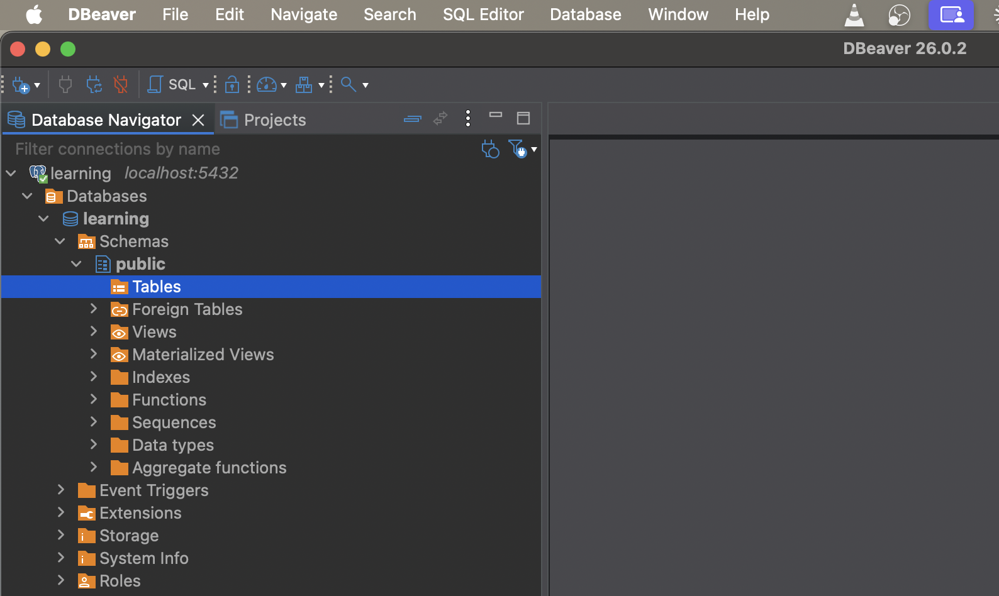
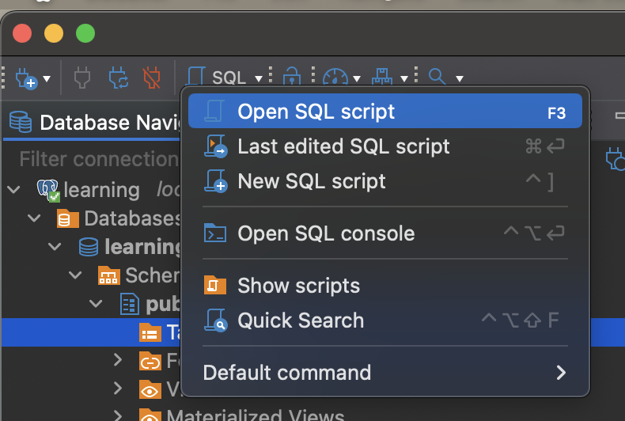
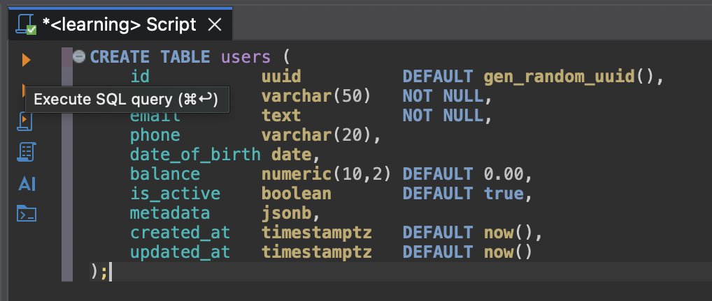
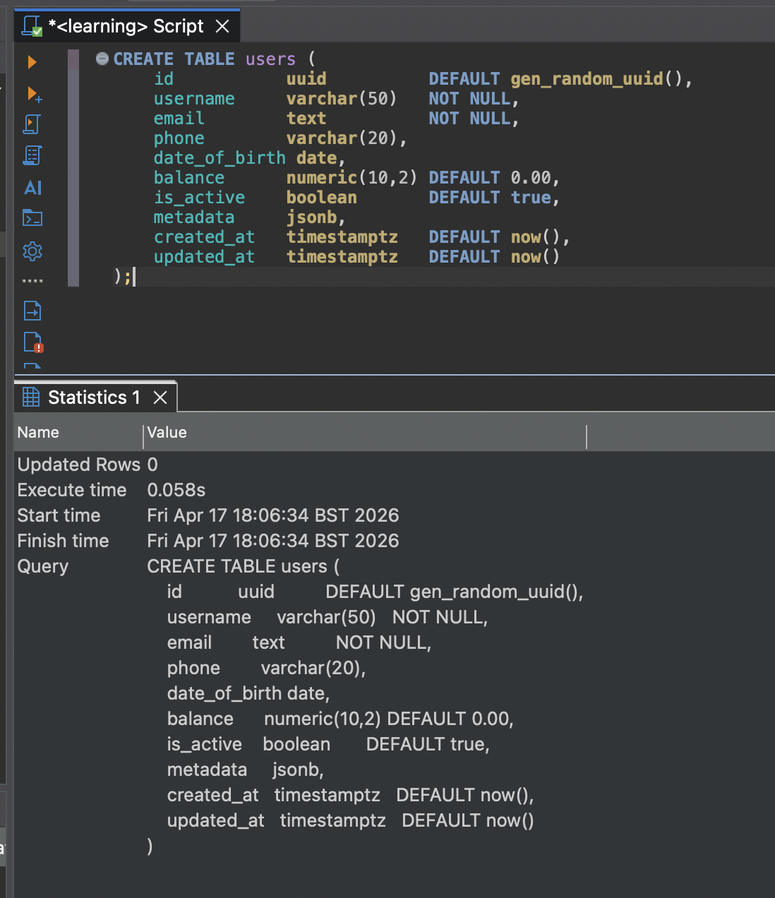
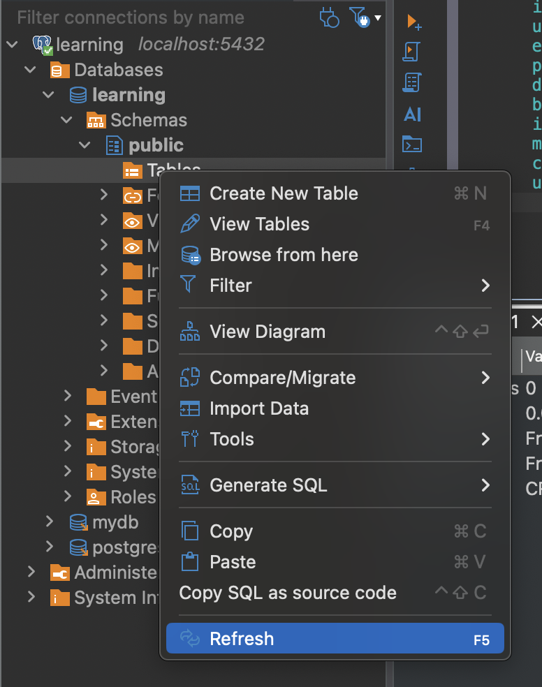
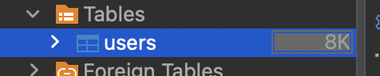
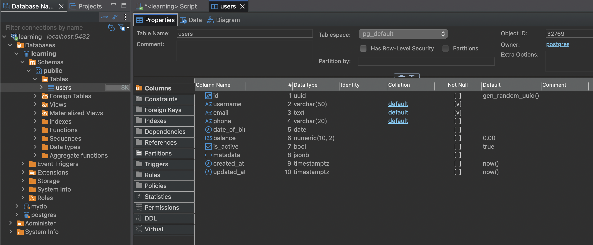
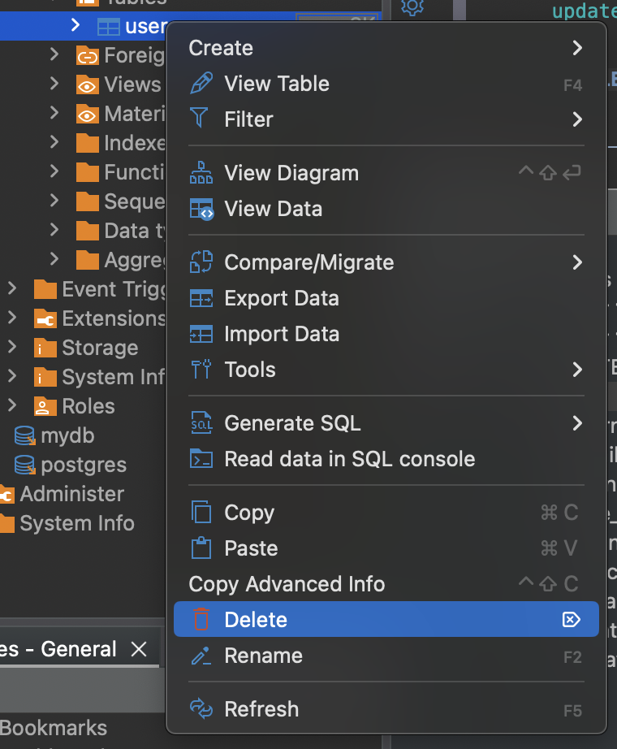
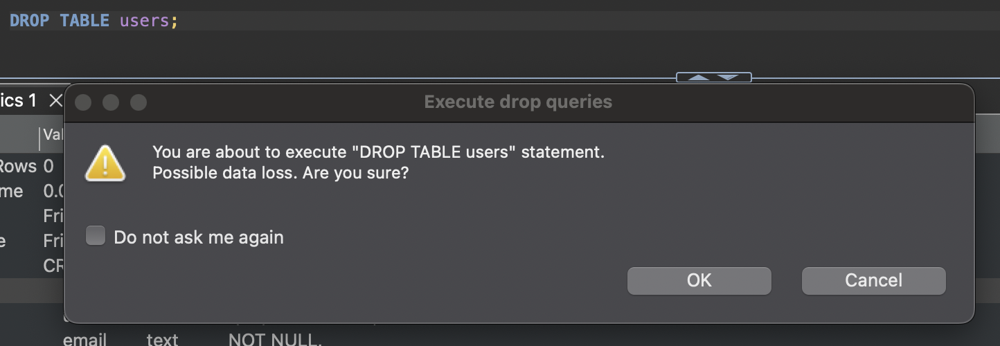

# Data Types & CREATE TABLE

> **Date:** 2026-04-13 | **Session #:** 6 | **Duration:** ~1h
> **Roadmap:** Phase 2 → Data types & CREATE TABLE
> **Docs:** [Chapter 8. Data Types](https://www.postgresql.org/docs/18/datatype.html) | [CREATE TABLE](https://www.postgresql.org/docs/18/sql-createtable.html)

To store data in PostgreSQL you need a table. To create a table you need to define columns — and every column has a type. This session covers the most common data types and how to use them in a real table.

---

## Prerequisites

- Docker container `pg_learning` running (`./setup.sh`)
- DBeaver connected to `localhost:5432`

---

## Key Concepts

- **Data type** — defines what kind of value a column can store and how much space it takes
- **`CREATE TABLE`** — SQL command to define a new table with its columns and types
- **`DROP TABLE`** — removes a table and all its data permanently
- **`\d table_name`** — psql meta-command to inspect table structure
- **Schema** — a namespace inside a database; by default tables are created in the `public` schema

---

## Data Types Overview

We cover the types you'll use in almost every real project:

### Numeric

| Type | Storage | Range | Use when |
|------|---------|-------|----------|
| `integer` (`int`) | 4 bytes | −2.1B to 2.1B | counts, quantities, most IDs |
| `bigint` | 8 bytes | −9.2 × 10¹⁸ to 9.2 × 10¹⁸ | large counters, timestamps as numbers |
| `numeric(p, s)` | variable | exact | money, precise calculations |
| `real` | 4 bytes | ~6 decimal digits | approximate floats |

> ⚠️ Ніколи не використовуй `real` або `float` для грошей — вони приблизні. Для грошей завжди `numeric`.

### Character

| Type | Use when |
|------|----------|
| `varchar(n)` | string with max length limit |
| `text` | string with no length limit |
| `char(n)` | fixed-length string, padded with spaces |

> 💡 В PostgreSQL `text` і `varchar` однаково ефективні — немає різниці в продуктивності. `text` — простіший вибір коли немає причини обмежувати довжину.

### Boolean

| Type | Values |
|------|--------|
| `boolean` | `true` / `false` / `NULL` |

### Date/Time

| Type | Storage | Use when |
|------|---------|----------|
| `date` | 4 bytes | date only (year, month, day) |
| `time` | 8 bytes | time only, no timezone |
| `timestamp` | 8 bytes | date + time, no timezone |
| `timestamptz` | 8 bytes | date + time + timezone |

> 💡 Завжди використовуй `timestamptz` замість `timestamp` — він зберігає timezone і коректно працює з різними часовими поясами. Особливо важливо для `created_at` / `updated_at`.

### UUID

| Type | Storage | Use when |
|------|---------|----------|
| `uuid` | 16 bytes | globally unique IDs, primary keys |

> 📝 UUID — популярний вибір для primary key в Node.js проектах. Prisma за замовчуванням генерує `uuid` для `@id` поля. На відміну від `serial`, UUID не розкриває кількість записів в таблиці і безпечний для публічних URL.

### JSON

| Type | Use when |
|------|----------|
| `json` | stores raw JSON text as-is |
| `jsonb` | stores JSON in binary format — faster to query |

> 💡 Завжди використовуй `jsonb` замість `json` — він індексується і швидший для пошуку. `json` зберігає оригінальний текст включно з пробілами — рідко потрібно.

---

## CREATE TABLE Syntax

Basic structure:

```sql
CREATE TABLE table_name (
    column_name data_type [constraints],
    column_name data_type [constraints],
    ...
);
```

---

## Practice: Create a users table
### Crateing a table in DBeaver

We create a `users` table that covers all the types.
For it you need to be connected to psql or use DBeaver query console. Select the `learning` database in DBeaver:


After open `Open SQL Script` in DBeaver, paste the following SQL and execute:


You'll see a new empty window where you can write and run SQL queries. Paste the `CREATE TABLE` statement below and run it:

> 📄 Script: [create_drop-users-table.sql](../queries/create_drop-users-table.sql)

```sql
CREATE TABLE users (
    id           uuid          DEFAULT gen_random_uuid(),
    username     varchar(50)   NOT NULL,
    email        text          NOT NULL,
    phone        varchar(20),
    date_of_birth date,
    balance      numeric(10,2) DEFAULT 0.00,
    is_active    boolean       DEFAULT true,
    metadata     jsonb,
    created_at   timestamptz   DEFAULT now(),
    updated_at   timestamptz   DEFAULT now()
);
```

To execute the query, click the green play button in the toolbar or press `Ctrl+Enter` (Cmd+Enter on macOS). Or press button on the left of the query to run only that statement:


 This will create the `users` table with the specified columns and types.

 If execution is successful, you should see a message like this.
 

and you need to refresh the database navigator to see the new table:



Column breakdown:

| Column | Type | Why |
|--------|------|-----|
| `id` | `uuid` | unique identifier, auto-generated |
| `username` | `varchar(50)` | username with max length |
| `email` | `text` | email, no length limit needed |
| `phone` | `varchar(20)` | phone number, optional |
| `date_of_birth` | `date` | date of birth, optional |
| `balance` | `numeric(10,2)` | exact decimal for money |
| `is_active` | `boolean` | flag, defaults to true |
| `created_at` | `timestamptz` | creation timestamp with timezone |
| `updated_at` | `timestamptz` | last update timestamp with timezone |
| `metadata` | `jsonb` | flexible extra data |

Verify the table was created:

In DBeaver, you need to dowble-click the `users` table in the database navigator to see its columns and structure.



### Creating a table in psql
You can also create the same table using psql. Connect to the `learning` database:

```bash
docker exec -it pg_learning psql -U postgres -d learning
```

```bash
psql (18.3 (Debian 18.3-1.pgdg13+1))
Type "help" for help.

learning=#
```
Before creating the table, you can check that it doesn't exist yet:

```sql
\dt
```
```sql
          List of tables
 Schema | Name  | Type  |  Owner   
--------+-------+-------+----------
 public | users | table | postgres
(1 row)
```

If it exists, you can drop it first:
> it removes the table and all its data permanently, so be careful with this command in real projects!
```sql
DROP TABLE users;
```

Then paste the same `CREATE TABLE` statement and execute it. You should see a confirmation that the table was created:

> 📄 Script: [create_drop-users-table.sql](../queries/create_drop-users-table.sql)

```sql
CREATE TABLE users (
    id           uuid          DEFAULT gen_random_uuid(),
    username     varchar(50)   NOT NULL,
    email        text          NOT NULL,
    phone        varchar(20),
    date_of_birth date,
    balance      numeric(10,2) DEFAULT 0.00,
    is_active    boolean       DEFAULT true,
    metadata     jsonb,
    created_at   timestamptz   DEFAULT now(),
    updated_at   timestamptz   DEFAULT now()
);
```

To verify the table was created, list tables again:
```sql
\dt
```

```sql
          List of tables
 Schema | Name  | Type  |  Owner   
--------+-------+-------+----------
 public | users | table | postgres
(1 row)
```

Inspect table structure:

```sql
\d users
```

```sql
                                Table "public.users"
    Column     |           Type           | Collation | Nullable |      Default      
---------------+--------------------------+-----------+----------+-------------------
 id            | uuid                     |           |          | gen_random_uuid()
 username      | character varying(50)    |           | not null | 
 email         | text                     |           | not null | 
 phone         | character varying(20)    |           |          | 
 date_of_birth | date                     |           |          | 
 balance       | numeric(10,2)            |           |          | 0.00
 is_active     | boolean                  |           |          | true
 metadata      | jsonb                    |           |          | 
 created_at    | timestamp with time zone |           |          | now()
 updated_at    | timestamp with time zone |           |          | now()
```

---

## DROP TABLE

Like in psql you can drop the table in DBeaver by right-clicking on it in the database navigator and selecting `Delete`:


or by running the `DROP TABLE` statement:

```sql
DROP TABLE users;
```


> ⚠️ `DROP TABLE` видаляє таблицю і **всі дані** в ній без підтвердження. Немає undo.

---

## Summary

- Every column in PostgreSQL has a strict type — choose it carefully, changing types later is painful
- Use `text` over `varchar` when there's no reason to limit length
- Use `timestamptz` over `timestamp` — always store timezone
- Use `numeric` for money — never `float` or `real`
- Use `jsonb` over `json` — faster and indexable
- UUID is a good choice for primary keys in Node.js projects — Prisma uses it by default

## What's Next

- [ ] INSERT — adding data to the table
- [ ] Basic SELECT — reading and filtering data
